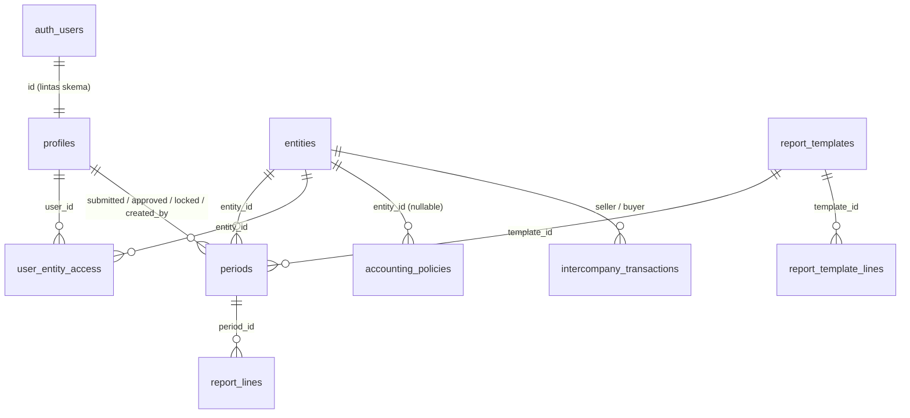

# Memeriksa database lewat DBeaver

Panduan menyambungkan DBeaver ke stack Supabase lokal dan membaca isinya:
tabel, relasi, constraint, trigger, view, dan — bagian yang paling mudah
disalahpahami — Row Level Security.

Seluruh angka dan nama di dokumen ini diambil dengan introspeksi terhadap
database yang sedang berjalan, bukan dari ingatan. Sumber kebenarannya tetap
`supabase/migrations/`; dokumen ini alat baca, bukan spesifikasi.

> **Baca dulu:** [`CLAUDE.md`](CLAUDE.md) invarian 1–8, dan
> [Aturan main di DBeaver](#9-aturan-main-di-dbeaver) di bawah. Menyunting data
> keuangan lewat klien SQL bisa menembus hal-hal yang sengaja dijaga aplikasi.

---

## 1. Menyambung

Nyalakan dulu stack-nya:

```sh
supabase start
supabase status          # mencetak seluruh URL dan kunci
```

Di DBeaver: **Database → New Database Connection → PostgreSQL**.

| Kolom | Nilai |
|---|---|
| Host | `127.0.0.1` |
| Port | `54322` |
| Database | `postgres` |
| Username | `postgres` |
| Password | `postgres` |
| Show all databases | boleh dicentang, tidak wajib |

Port **54322** adalah Postgres. Jangan tertukar dengan 54321 (REST/Auth
gateway) atau 54323 (Supabase Studio) — keduanya bukan port database dan
DBeaver tidak akan bisa menyambung ke sana.

Versi server: **PostgreSQL 17.6**.

Kredensial ini hanya berlaku untuk database lokal di mesin Anda. Tidak ada
kaitannya dengan lingkungan mana pun yang ter-deploy.

### Skema yang perlu dilihat

| Skema | Isi | Perlu dibuka? |
|---|---|---|
| `public` | Seluruh tabel aplikasi, 10 tabel + 4 view | Ya |
| `auth` | Milik Supabase GoTrue. Yang relevan hanya `auth.users` | Sesekali |
| `storage`, `realtime`, `vault`, … | Bawaan Supabase, tidak dipakai proyek ini | Tidak |

Kalau `public` tidak muncul, aktifkan **Show all databases** atau periksa
filter skema di properti koneksi.

---

## 2. Peta tabel

Sepuluh tabel, semuanya dengan RLS aktif.

| Tabel | Kolom | Policy | Isinya |
|---|---:|---:|---|
| `entities` | 14 | 2 | Empat PT. Satu baris = satu badan hukum dengan NPWP sendiri |
| `profiles` | 7 | 2 | Pengguna aplikasi: nama, peran, aktif/tidak |
| `user_entity_access` | 4 | 2 | Penautan staf ke entitas. Kunci komposit |
| `report_templates` | 7 | 2 | Struktur laporan, berversi |
| `report_template_lines` | 9 | 2 | Pos-pos di dalam template |
| `periods` | 15 | 3 | Satu bulan pelaporan untuk satu entitas |
| `report_lines` | 7 | 2 | **Tabel fakta.** Satu angka input untuk satu periode |
| `intercompany_transactions` | 11 | 2 | Registry transaksi antar-perusahaan |
| `accounting_policies` | 11 | 2 | Register keputusan akuntansi, boleh `NULL` |
| `audit_log` | 8 | 1 | Jejak audit, hanya-tambah |

Tabel yang paling sering dibuka: `periods` dan `report_lines`. Keduanya yang
membentuk angka di setiap layar.

---

## 3. Relasi

DBeaver bisa menggambar ini otomatis: klik ganda skema `public` → tab
**ER Diagram**. Diagram itu dibangun dari foreign key, jadi baca dulu
[bagian 4](#4-relasi-yang-tidak-muncul-di-er-diagram) sebelum menyimpulkan
ada relasi yang hilang.



Lima belas foreign key di `public`, plus satu lintas skema:

| Dari | Kolom | Ke | ON DELETE |
|---|---|---|---|
| `profiles` | `id` | `auth.users.id` | CASCADE |
| `periods` | `entity_id` | `entities.id` | **RESTRICT** |
| `periods` | `template_id` | `report_templates.id` | **RESTRICT** |
| `periods` | `submitted_by` | `profiles.id` | NO ACTION |
| `periods` | `approved_by` | `profiles.id` | NO ACTION |
| `periods` | `locked_by` | `profiles.id` | NO ACTION |
| `periods` | `created_by` | `profiles.id` | NO ACTION |
| `report_lines` | `period_id` | `periods.id` | CASCADE |
| `report_template_lines` | `template_id` | `report_templates.id` | CASCADE |
| `user_entity_access` | `user_id` | `profiles.id` | CASCADE |
| `user_entity_access` | `entity_id` | `entities.id` | CASCADE |
| `user_entity_access` | `granted_by` | `profiles.id` | NO ACTION |
| `accounting_policies` | `entity_id` | `entities.id` | CASCADE |
| `intercompany_transactions` | `seller_entity_id` | `entities.id` | **RESTRICT** |
| `intercompany_transactions` | `buyer_entity_id` | `entities.id` | **RESTRICT** |
| `intercompany_transactions` | `recorded_by` | `profiles.id` | NO ACTION |

`RESTRICT` pada `periods.entity_id` disengaja: entitas yang sudah punya
laporan tidak boleh terhapus dan membawa laporannya ikut hilang.

---

## 4. Relasi yang **tidak** muncul di ER diagram

Tiga hubungan nyata tidak diwujudkan sebagai foreign key. Ini keputusan
desain, bukan kelalaian — kalau Anda memeriksa "kesolidan" skema, justru ini
yang perlu dipahami.

### `report_lines.line_code` → `report_template_lines.line_code`

Bukan FK. Alasannya ada di migrasi: template berversi, dan periode historis
harus tetap terbaca dengan label yang berlaku saat itu. FK ke
`report_template_lines.id` akan mengunci baris lama ke versi template yang
mungkin sudah diganti.

Yang menjaganya adalah trigger `report_lines_template_guard`, bukan FK. Ia
menolak `line_code` yang tidak ada di template milik periode tersebut.

Kenapa penting: `v_period_pnl` menjumlahkan lewat join ke
`report_template_lines`. `line_code` yang tidak cocok menghasilkan `section`
NULL, sehingga nominalnya **hilang dari pendapatan, beban, dan laba bersih
sekaligus** — laporannya tetap "seimbang" dan tetap salah. Periksa berkala:

```sql
select rl.id, rl.line_code, e.code, p.period
  from report_lines rl
  join periods p  on p.id = rl.period_id
  join entities e on e.id = p.entity_id
  left join report_template_lines tl
         on tl.template_id = p.template_id
        and tl.line_code   = rl.line_code
 where tl.line_code is null;
```

Harus nol baris. Kalau ada isinya, ada angka yang menguap dari laporan.

### `audit_log.table_name` + `record_pk` → apa pun

Polimorfik: satu tabel audit untuk enam tabel. `record_pk` bertipe `text`
karena `user_entity_access` berkunci komposit dan disimpan sebagai
`user_id:entity_id`. Tidak ada FK yang bisa menyeberang seperti itu.

### `accounting_policies.policy_key`

Teks bebas, tidak ada tabel referensi. Daftar kuncinya ada di
[`ASSUMPTIONS.md`](ASSUMPTIONS.md).

---

## 5. View

Empat view, semuanya `security_invoker = on`.

| View | Menjawab |
|---|---|
| `v_period_pnl` | Laba rugi satu entitas satu periode, subtotal sudah dihitung |
| `v_period_completeness` | Berapa entitas sudah melapor di satu periode, siapa yang belum |
| `v_group_consolidated` | Jumlah aritmetik, eliminasi, dan hasil konsolidasi |
| `v_period_comparison` | Pembanding bulan lalu (MoM) dan tahun lalu (YoY), kolom terpisah |

**Subtotal tidak pernah disimpan** (invarian 2). Laba kotor, laba operasi dan
laba bersih hanya ada di `v_period_pnl`. Kalau Anda menemukan kolom
`gross_profit` di sebuah tabel, itu bug.

`security_invoker = on` berarti view memakai hak pemanggil, bukan hak
pembuatnya. Tanpa itu view akan membocorkan data lintas entitas. Di DBeaver
Anda menyambung sebagai pemilik tabel, jadi view menampilkan semuanya — lihat
[bagian 8](#8-rls-dan-kenapa-dbeaver-tidak-menunjukkannya).

Definisi lengkapnya: klik kanan view → **View Source**, atau
`select pg_get_viewdef('v_period_pnl'::regclass, true);`

---

## 6. Enum

Lima tipe enum. DBeaver menampilkannya di **Data Types**.

| Tipe | Nilai |
|---|---|
| `user_role` | `direksi`, `manajer_keuangan`, `staf_entitas`, `auditor` |
| `period_status` | `draft`, `submitted`, `approved`, `locked` |
| `line_section` | `revenue`, `cogs`, `opex`, `other_income`, `other_expense`, `tax` |
| `reporting_basis` | `cash`, `accrual`, `unknown` |
| `revenue_presentation` | `gross`, `net`, `unknown` |

`unknown` adalah nilai yang sah, bukan nilai yang hilang. Artinya kebijakannya
memang belum ditetapkan (ASSUMPTIONS.md A-1, A-4), dan UI wajib mengatakannya
alih-alih menebak.

---

## 7. Constraint dan trigger

### Check constraint

| Tabel | Nama | Aturan |
|---|---|---|
| `periods` | `period_must_be_first_day` | Periode selalu tanggal 1 |
| `intercompany_transactions` | `ic_period_first_day` | Sama |
| `intercompany_transactions` | `different_entities` | Penjual ≠ pembeli |
| `intercompany_transactions` | `amount_check` | Nominal > 0 |
| `entities` | `ownership_pct_check` | 0 < pct ≤ 100 |
| `entities` | `fiscal_year_start_month_check` | 1–12 |
| `accounting_policies` | `decision_requires_accountability` | Keputusan wajib punya `rationale`, `decided_by`, `effective_from` |

### Unique yang menentukan bentuk data

- `periods (entity_id, period)` — satu entitas satu bulan, sekali
- `report_lines (period_id, line_code)` — satu pos sekali per periode
- `report_template_lines (template_id, line_code)` dan `(template_id, sort_order)`
- `report_templates (code, version)`
- `accounting_policies (policy_key, coalesce(entity_id,…), coalesce(effective_from,'-infinity'))`
  — memakai `coalesce` karena `NULL` tidak pernah sama dengan `NULL` di indeks
  unik, dan baris ber-`chosen_value` NULL justru yang paling mungkin
  terduplikasi

### Trigger

Enam belas trigger. Yang mengubah perilaku tulis:

| Tabel | Trigger | Kapan | Menjaga |
|---|---|---|---|
| `periods` | `periods_insert_guard` | BEFORE INSERT | Periode baru selalu lahir `draft`; kolom jejak alur kerja ditimpa NULL |
| `periods` | `periods_transition_guard` | BEFORE UPDATE | Transisi status sah, pemisahan tugas, catatan wajib, hanya direksi yang membuka kunci |
| `report_lines` | `report_lines_guard` | BEFORE INS/UPD/DEL | Baris hanya bisa diubah selama periode `draft` |
| `report_lines` | `report_lines_template_guard` | BEFORE INS/UPD | `line_code` harus ada di template periode |
| `audit_log` | `audit_log_immutable` | BEFORE UPD/DEL | Menolak perubahan apa pun |
| enam tabel | `audit_*` | AFTER INS/UPD/DEL | Menulis `audit_log` |
| lima tabel | `*_updated_at` | BEFORE UPDATE | Mengisi `updated_at` |

**Trigger tetap berjalan di DBeaver.** Menyambung sebagai pemilik tabel
melewati RLS, tetapi tidak melewati trigger.

---

## 8. RLS, dan kenapa DBeaver tidak menunjukkannya

Ini bagian terpenting dokumen ini.

Sepuluh tabel punya RLS aktif dan total 20 policy. Tapi di DBeaver Anda
menyambung sebagai `postgres`, yang merupakan **pemilik** tabel-tabel itu —
dan RLS tidak berlaku bagi pemilik kecuali tabelnya di-`FORCE ROW LEVEL
SECURITY`. Di sini tidak.

Terukur, dengan query yang sama dijalankan dua kali di sesi yang sama:

```
sebagai postgres          : entities -> ILJ, AMDK, TAMBANG, GARAM
sebagai staf ILJ (ditiru) : entities -> ILJ
```

(`entities` dipakai sebagai contoh karena jumlahnya tetap empat setelah
`npm run db:reset`. Jumlah `periods` ikut berubah-ubah tergantung apa yang
sedang Anda kerjakan, jadi kurang cocok jadi patokan.)

Artinya: **apa yang Anda lihat di DBeaver bukan apa yang dilihat aplikasi.**
Jangan pernah menyimpulkan "datanya bocor" atau "datanya aman" dari tampilan
DBeaver saja.

(Catatan kecil: `postgres` di stack Supabase lokal bukan superuser —
`usesuper = false`. Yang membuatnya melewati RLS adalah status pemilik tabel,
bukan superuser.)

### Meniru pengguna sungguhan

Untuk melihat persis apa yang dilihat satu peran, pinjam identitasnya di dalam
transaksi. Jalankan seluruh blok sekaligus di DBeaver
(**Execute script**, bukan Execute statement):

```sql
begin;

-- ganti role dari pemilik tabel ke role yang dipakai aplikasi
set local role authenticated;

-- klaim JWT yang dibaca auth.uid(); ambil uuid-nya dari auth.users
set local request.jwt.claims =
  '{"sub":"<uuid-pengguna>","role":"authenticated"}';

select current_user, current_user_role();
select count(*) from periods;
select code from entities;

rollback;   -- selalu rollback: ini pemeriksaan, bukan perubahan
```

Mengambil uuid-nya:

```sql
select id, email from auth.users order by email;
```

Terverifikasi dengan akun seed:

| Ditiru | `current_user_role()` | `entities` terlihat |
|---|---|---|
| `staf.ilj@example.test` | `staf_entitas` | ILJ saja |
| `auditor@example.test` | `auditor` | ILJ, AMDK, TAMBANG, GARAM — karena seed menugaskan keempatnya, bukan karena perannya |

Sejak migrasi `20250104000000_scope_manager_auditor.sql`, hanya `direksi` yang
melihat seluruh entitas tanpa penugasan. `manajer_keuangan` dan `auditor`
ber-scope lewat `user_entity_access` persis seperti `staf_entitas`; cabut satu
baris dan entitasnya hilang dari hasil di atas.

`rollback` di akhir bukan formalitas. `set local` hanya berlaku sampai
transaksi selesai, dan mengakhirinya dengan `rollback` memastikan tidak ada
apa pun yang tidak sengaja ikut tersimpan.

### Membaca policy-nya

```sql
select tablename, policyname, cmd, qual, with_check
  from pg_policies where schemaname = 'public'
 order by tablename, policyname;
```

`qual` adalah klausa `USING` (baris mana yang terlihat), `with_check` adalah
`WITH CHECK` (baris mana yang boleh ditulis). Lima fungsi pembantu yang
dipanggil hampir semua policy — `current_user_role()`,
`can_read_all_entities()`, `can_read_group_data()`, `can_approve()`,
`has_entity_access()` — semuanya `SECURITY DEFINER`, supaya policy yang
membaca `profiles` tidak memicu rekursi RLS.

Dua di antaranya mudah tertukar dan sengaja dipisah:

| Fungsi | Peran | Untuk apa |
|---|---|---|
| `can_read_all_entities()` | `direksi` | Cakupan BARIS per entitas. Dipanggil `has_entity_access()`. |
| `can_read_group_data()` | `direksi`, `manajer_keuangan`, `auditor` | Tabel yang tidak punya `entity_id` sama sekali: `profiles`, `intercompany_transactions`, `audit_log`. |

Cakupan entitas tidak bisa mempersempit tabel yang tidak punya kolom entitas.
Menggabungkan keduanya akan mencabut nama pengaju dari antrean Persetujuan, dan
membuat `ic_manage` memberi manajer hak tulis atas baris yang tidak bisa ia
baca kembali.

---

## 9. Aturan main di DBeaver

DBeaver adalah alat baca untuk proyek ini. Beberapa hal yang perlu diketahui
sebelum tergoda menyunting sel di grid:

**Jangan menyunting `report_lines` atau `periods` lewat grid.** Trigger tetap
berjalan, jadi sebagian akan ditolak dengan pesan Indonesia — itu bagus. Yang
tidak bagus adalah yang berhasil: `auth.uid()` bernilai NULL di sesi DBeaver,
sehingga `audit_log.actor_id` ikut NULL. Jejak auditnya jadi menyebut "tidak
ada siapa-siapa". Cek kebocoran seperti itu:

```sql
select count(*) from audit_log
 where actor_id is null and table_name in ('periods','report_lines');
```

Harus `0`. Kalau tidak, ada tulisan yang masuk di luar sesi pengguna.

**Kalau memang perlu menulis, tirukan penggunanya** — pola `set local role` +
klaim JWT di bagian 8, persis seperti yang dilakukan `supabase/seed.sql`.
Dengan begitu trigger, pemisahan tugas, dan atribusi audit berjalan seperti
lewat aplikasi.

**Jangan mengubah struktur lewat DBeaver.** Skema itu maju-saja lewat
`supabase/migrations/`. Perubahan yang dibuat langsung akan hilang pada
`npm run db:reset` berikutnya, dan sementara itu membuat database Anda berbeda
dari yang dipakai orang lain.

**`npm run db:reset` menghapus seluruh isi database.** Kalau ada rekan (atau
dev server Anda sendiri) yang sedang memakai stack lokal yang sama, data mereka
ikut hilang.

---

## 10. Query pemeriksaan siap tempel

Enam query yang menjawab "apakah database ini masih waras".

### 10.1 Setiap tabel punya RLS dan minimal satu policy

```sql
select c.relname
  from pg_class c join pg_namespace n on n.oid = c.relnamespace
 where n.nspname = 'public' and c.relkind = 'r'
   and (c.relrowsecurity = false
        or (select count(*) from pg_policies p
             where p.tablename = c.relname and p.schemaname = 'public') = 0);
```

Harus kosong. Tabel yang muncul di sini bisa dibaca tanpa aturan.

### 10.2 Setiap tabel dan view punya GRANT

```sql
select c.relname
  from pg_class c join pg_namespace n on n.oid = c.relnamespace
 where n.nspname = 'public' and c.relkind in ('r','v')
   and not has_table_privilege('authenticated', c.oid, 'SELECT');
```

Harus kosong. RLS **mempersempit** hak, tidak memberikannya: tabel dengan
policy tapi tanpa GRANT gagal di setiap query dengan `42501`.

### 10.3 Tidak ada baris yatim

```sql
select count(*) as baris_tanpa_pos
  from report_lines rl
  join periods p on p.id = rl.period_id
  left join report_template_lines tl
         on tl.template_id = p.template_id and tl.line_code = rl.line_code
 where tl.line_code is null;
```

Harus `0`. Lihat [bagian 4](#4-relasi-yang-tidak-muncul-di-er-diagram).

### 10.4 Aritmetika view konsisten dengan barisnya

```sql
select entity_code, period,
       revenue, cogs, gross_profit,
       revenue - cogs                     as hitung_ulang,
       gross_profit - (revenue - cogs)    as selisih
  from v_period_pnl
 order by period, entity_code;
```

Kolom `selisih` harus nol di semua baris.

### 10.5 Tidak ada subtotal yang tersimpan

```sql
select table_name, column_name
  from information_schema.columns
 where table_schema = 'public'
   and column_name in ('gross_profit','operating_profit','net_profit','net_margin_pct')
   and table_name not like 'v\_%';
```

Harus kosong. Subtotal hanya boleh hidup di view (invarian 2).

### 10.6 Alur kerja satu periode, dari jejak auditnya

```sql
select a.occurred_at,
       coalesce(p.full_name, '(di luar sesi pengguna)') as pelaku,
       (a.old_value ->> 'status') || ' -> ' || (a.new_value ->> 'status') as transisi
  from audit_log a
  left join profiles p on p.id = a.actor_id
 where a.table_name = 'periods' and a.action = 'UPDATE'
   and (a.old_value ->> 'status') is distinct from (a.new_value ->> 'status')
 order by a.occurred_at;
```

Setiap langkah harus menyebut nama. `(di luar sesi pengguna)` berarti ada
tulisan yang tidak lewat sesi mana pun — biasanya justru dari klien SQL.

---

## Rujukan

| File | Isi |
|---|---|
| `supabase/migrations/` | Sumber kebenaran skema. Maju-saja |
| `supabase/seed.sql` | Data pengembangan lokal, termasuk empat akun uji |
| [`CLAUDE.md`](CLAUDE.md) | Delapan invarian yang tidak boleh dilanggar |
| [`CONTEXT.md`](CONTEXT.md) | Kosakata domain: entitas, periode, tagihan, rekanan |
| [`ASSUMPTIONS.md`](ASSUMPTIONS.md) | Kebijakan akuntansi yang belum diputuskan |
| [`TESTING.md`](TESTING.md) | Uji manual yang tersisa, plus checklist regresi |
